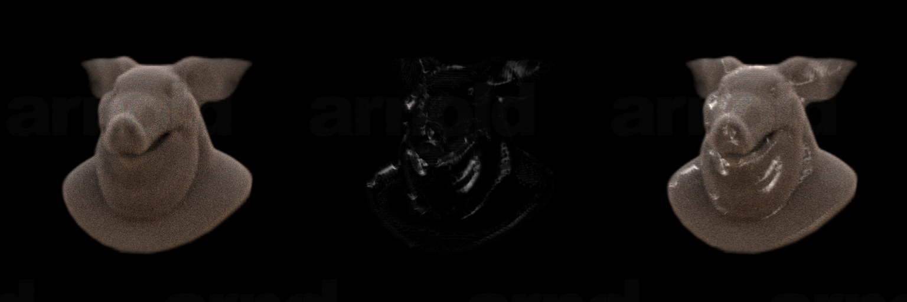

# Arnold Specular for Volumes - Nyx Blinn



This node generates accumulated reflection values based on Blinn-Phong model.
$$I_{specular} = K_s I_{light}(H.N)^{n}$$

**N** - Specular Power

**I**   - Light Direction

**H** - Halfway Vector between Light Direction and Viewer

**N** - Surface Normal

**n** - Power


Refer to the example hip file for a basic shader setup.

## Compilation
You can compile using command line or from Visual Studio.

#### Linux
````
export ARNOLD_PATH=/path/to/arnold
c++ arnoldVolumeSpecular.cpp -o arnoldVolumeSpecular.so -Wall -O2 -shared -fPIC -I$ARNOLD_PATH/include -L$ARNOLD_PATH/bin -lai
````

#### Windows

````
set ARNOLD_PATH=c:/path/to/arnold
cl /LD arnoldVolumeSpecular.cpp /I %ARNOLD_PATH%/include %ARNOLD_PATH%/lib/ai.lib /link /out:arnoldVolumeSpecular.dll
````

Please refer to this for creating basic Arnold plugin,
https://help.autodesk.com/view/ARNOL/ENU/?guid=arnold_dev_guide_plugins_av_Creating_a_Simple_Plugin_html

Additionally you can refer to this for setting up a Visual Studio project and compile from there. 
https://www.youtube.com/watch?v=BrZYnjoZLj8

## Installation
 Copy the generated .dll or .so to htoA_path/scripts/plugin. 
 This Arnold node can be accessed inside Arnold Material Builder. 

## Usage 

This node requires a Normal vector as input. 
For surface, you can get it using the State Float node. 
For volumes, create gradient of the density, normalize it in SOPs.  And import that using Volume Sample RGB.

This node generates accumulated reflection values. Connect the output to the emission color of the Standard Volume shader.
Check the example hip file for the reference values. 

There are precompiled .dll files in this project. These are compiled for 
Houdini 20.0.547 and HtoA 6.2.5.1.

## Known Issues

 - Reflection is not physically correct.
 - Code is bad!! This is my first Arnold C++ API project. I'm open to criticism and improvement. 
 - Rendering is very slow. This is because currently I'm using all the light samples in light loop. Need to figure a way get only the important samples.
## Future
 - Implement the same using Closures for physically accurate reflection and faster rendering since we be skipping the light loops.
